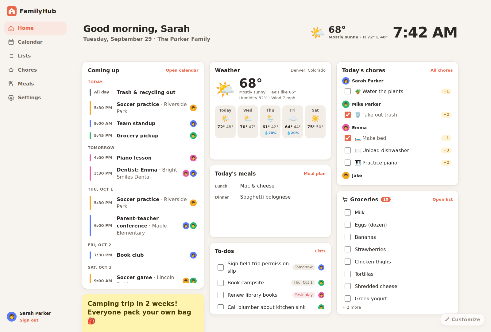
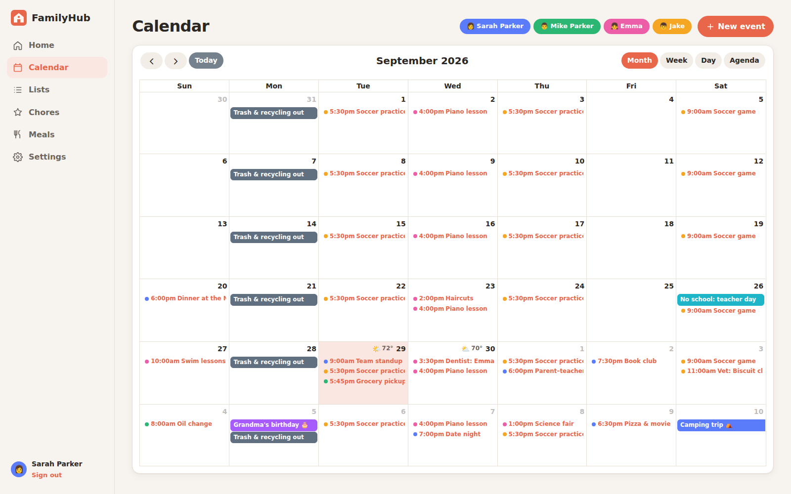
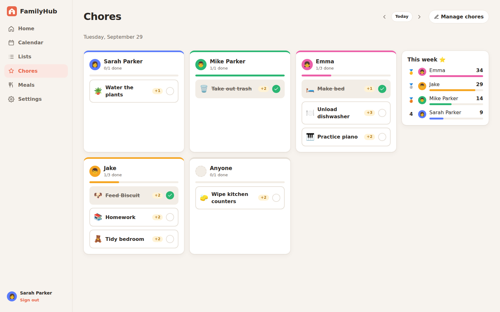
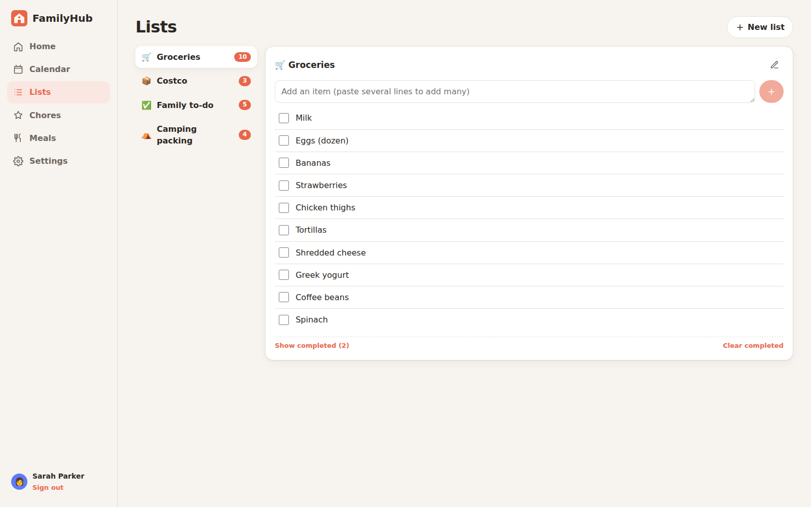
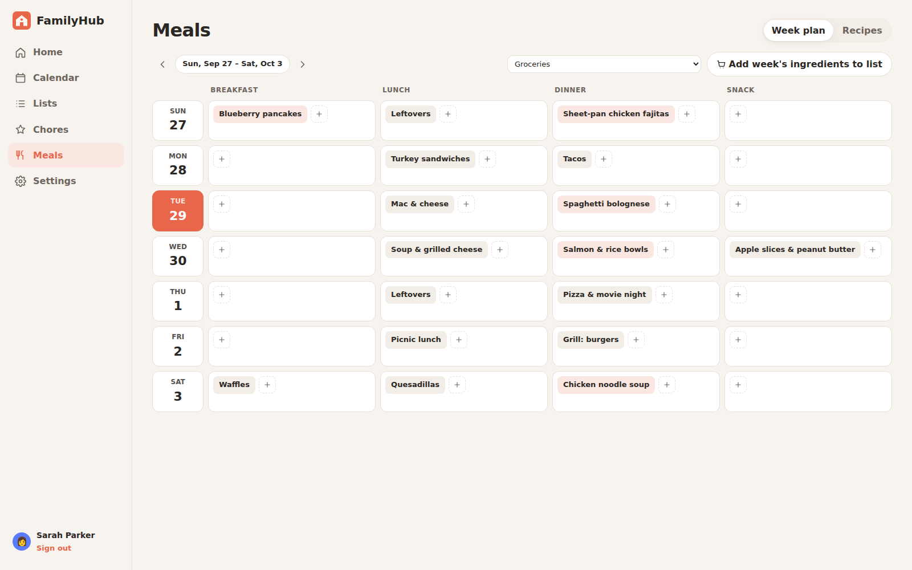
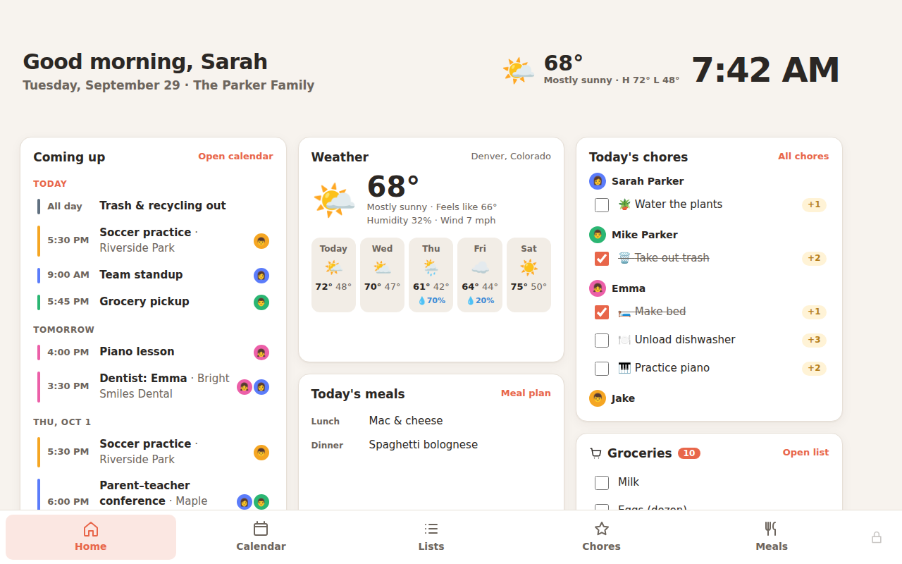
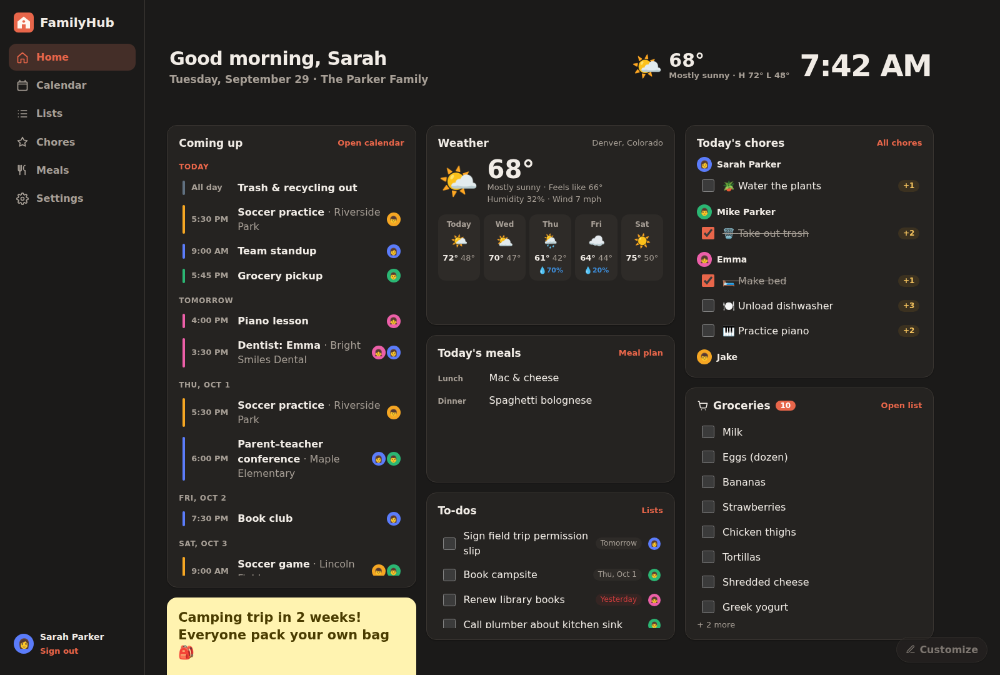
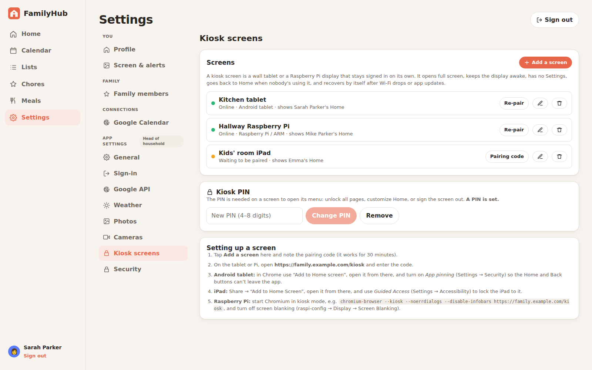
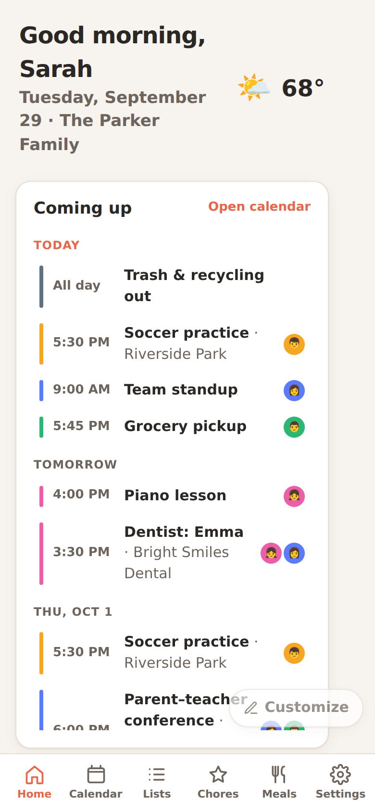
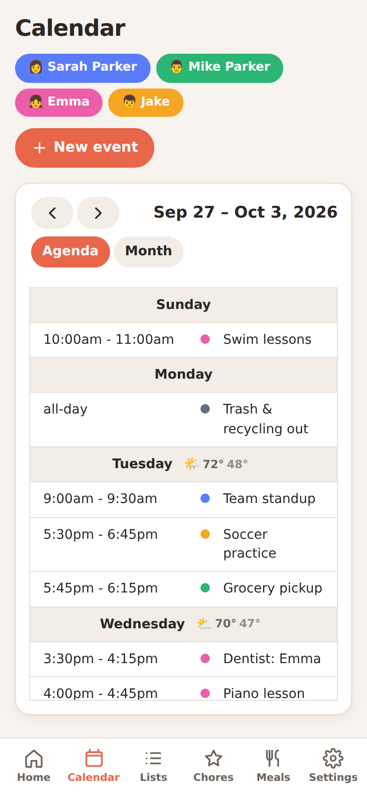

# FamilyHub

A self-hosted family organizer for your home server. It gives the whole family:

- a shared calendar with **two-way Google Calendar sync**
- shopping and to-do lists
- chores with points
- a meal planner and recipe box
- a customizable Home dashboard with weather, a family photo slideshow and **UniFi Protect cameras**
- **kiosk mode** for wall tablets and Raspberry Pi screens

It runs in Docker (Node, Postgres and go2rtc). You use it as a web app or an installable PWA on phones, tablets and computers.

Sign-in options: **Authentik (OIDC)** and/or local email + password accounts. Everything, including API keys and secrets, is set up from inside the app. The only thing you have to put in a config file is a database password.

---

## Screenshots

These use a demo install filled with a made-up family (the "Parkers"), not real data.



| Calendar | Chores |
|---|---|
|  |  |
| **Lists** | **Meals** |
|  |  |
| **Kiosk mode on a wall tablet** | **Dark mode** |
|  |  |

| Settings → Kiosk screens | On a phone |
|---|---|
|  |   |

---

## Contents

- [Screenshots](#screenshots)
- [Features](#features)
- [Installation](#installation)
  - [What you need](#what-you-need)
  - [Step 1: Install Docker](#step-1-install-docker)
  - [Step 2: Download FamilyHub](#step-2-download-familyhub)
  - [Step 3: Set the database password](#step-3-set-the-database-password)
  - [Step 4: Start FamilyHub](#step-4-start-familyhub)
  - [Step 5: Create the first account](#step-5-create-the-first-account)
  - [Step 6: Put it behind HTTPS (recommended)](#step-6-put-it-behind-https-recommended)
  - [Step 7: Set up the extras](#step-7-set-up-the-extras)
  - [Updating](#updating)
  - [Troubleshooting](#troubleshooting)
- [Authentik (OIDC) setup](#authentik-oidc-setup)
- [Google Calendar setup (two-way sync)](#google-calendar-setup-two-way-sync)
- [Customizing the Home page](#customizing-the-home-page)
- [Family and roles](#family-and-roles)
- [Chore approval and parent notifications](#chore-approval-and-parent-notifications)
- [Cameras (UniFi Protect)](#cameras-unifi-protect)
- [Kiosk screens (wall tablets, Raspberry Pi)](#kiosk-screens-wall-tablets-raspberry-pi)
- [Weather](#weather)
- [Photo slideshow (Home screensaver)](#photo-slideshow-home-screensaver)
- [Configuration reference](#configuration-reference)
- [Backups and restore](#backups-and-restore)
- [Security notes](#security-notes)
- [Development](#development)
- [License](#license)

---

## Features

| Area | What you get |
|---|---|
| **Home** | A dashboard made of widgets that each person can rearrange and resize with a drag-and-drop editor. Widgets: greeting and clock, big clock, weather, cameras, coming up, today's chores, today's meals, shopping lists, to-dos and sticky notes. Colours, dark mode, text size and background can all be changed. |
| **Calendar** | Month, week, day and agenda views that fill the window. Each day shows the weather forecast. Events are colour-coded by family member, and you can filter by member. Drag events to move or resize them. Repeating events are supported (daily, weekly, every 2 weeks, monthly, yearly), with an optional end date. |
| **Google sync** | Each person connects their own Google account(s) and picks which calendars to show and who each one belongs to. Changes made in FamilyHub are written to Google right away. Changes made in Google are pulled in every 5 minutes, or on demand. |
| **Lists** | Multiple shopping and to-do lists. Paste many lines to add many items at once. Items can have an assignee and a due date. |
| **Chores** | Daily, specific-weekday or one-time chores, for one person or "anyone". Tap to complete. Points feed a weekly leaderboard. |
| **Meals** | A weekly planner and a recipe box. Send a recipe's ingredients, or the whole week's, to a shopping list in one click. |
| **Weather** | Current conditions and a forecast from Open-Meteo. It's free and needs no API key. |
| **Photo slideshow** | After a minute with nobody touching the Home page, a full-screen slideshow starts. Photos come from Amazon Photos shared links and/or Immich. |
| **Cameras** | UniFi Protect snapshots and live video on Home, low-latency WebRTC on your home network, and a doorbell pop-up on every screen when someone rings. |
| **Kiosk screens** | Pair a wall tablet or Raspberry Pi with a one-time code. It stays signed in, runs full screen, keeps the display awake, recovers by itself and is locked with a PIN. |
| **Family** | A head of household manages the family name, adults and children, their colours, avatars and logins. |
| **Settings** | Everything is set up inside the app, in tabs: You, Family, Connections and App settings. Secrets are encrypted and never sent back to the browser. |

---

## Installation

These steps use **Ubuntu Server 22.04 or 24.04**. Any Linux machine that can run Docker works the same way, including a NAS or a Raspberry Pi 4/5 with 64-bit OS; the image is built for both amd64 and arm64.

### What you need

- A computer or VM that stays on: 2 CPU cores, 2 GB RAM and 10 GB of disk is plenty.
- Docker Engine with the Compose plugin (step 1).
- Optional, but recommended: a hostname and HTTPS through a reverse proxy (step 6), for example Nginx Proxy Manager, Traefik or Caddy. Phones need HTTPS to install the app, and wall screens need it to stay awake.

### Step 1: Install Docker

Skip this if `docker compose version` already works.

```bash
curl -fsSL https://get.docker.com | sudo sh
sudo usermod -aG docker $USER     # lets you run docker without sudo
newgrp docker                     # or log out and back in
docker compose version            # should print a version number
```

If you see **`permission denied while trying to connect to the docker API at unix:///var/run/docker.sock`**, the group change hasn't taken effect yet. Log out and back in (or run `newgrp docker`), or put `sudo` in front of the docker commands.

### Step 2: Download FamilyHub

```bash
cd ~
git clone https://github.com/hardynetworks/FamilyHub.git
cd FamilyHub
```

If `git` is missing: `sudo apt install -y git`.

### Step 3: Set the database password

```bash
cp .env.example .env
openssl rand -base64 32          # copy the random password this prints
nano .env                        # paste it after POSTGRES_PASSWORD=, then save (Ctrl+O, Enter, Ctrl+X)
```

`.env` should now contain a line like:

```
POSTGRES_PASSWORD=Zx8...your-random-password...Qk=
```

> Set the password **before** the first start and don't change it afterwards. The database remembers the password it was created with.

Other optional settings in `.env`:

| Variable | Default | What it does |
|---|---|---|
| `KINBOARD_PORT` | `3000` | The port FamilyHub is reachable on (`http://<server-ip>:3000`). |
| `WEBRTC_PORT` | `8555` | The camera video port used for WebRTC. Only change it if 8555 is already taken. |
| `TZ` | `UTC` | The household time zone. You can also set it on the setup screen. |

### Step 4: Start FamilyHub

```bash
docker compose pull      # downloads the prebuilt images
docker compose up -d     # starts FamilyHub, Postgres and the camera relay in the background
docker compose ps        # all three should be "running" (the database shows "healthy")
docker compose logs -f app
```

When the log shows `FamilyHub listening on :3000`, press **Ctrl+C** to stop watching the logs; FamilyHub keeps running. It starts again on its own after a reboot.

Find the server's address with `hostname -I`, the first address shown, for example `192.168.1.20`.

If you use the `ufw` firewall, open the ports:

```bash
sudo ufw allow 3000/tcp   # the web app (not needed if only your reverse proxy on this server reaches it)
sudo ufw allow 8555       # camera video over WebRTC, TCP and UDP (only if you use cameras)
```

### Step 5: Create the first account

Open `http://<server-ip>:3000` in a browser. The first screen creates the **head of household** account (name, email and password). It also records the family name, the app's address and your time zone.

> Do this right away. Until the first account exists, anyone who can reach the page can create it.

### Step 6: Put it behind HTTPS (recommended)

Point a hostname such as `family.example.com` at your reverse proxy, and forward it to `http://<server-ip>:3000`. Then:

1. **Turn on WebSocket support** for this host. Live camera video and the doorbell pop-up need it. In Nginx Proxy Manager it's the "Websockets Support" switch.
2. Make sure the proxy sends `X-Forwarded-Proto`. Most do by default, and FamilyHub uses it to mark cookies `Secure` over HTTPS.
3. In FamilyHub, open **Settings → App settings → General** and set **Public address** to the HTTPS URL your family uses. Sign-in and Google redirect addresses are built from it.

FamilyHub can stay **VPN-only** (for example, behind NetBird or Tailscale). The Google and Authentik sign-in redirects happen in your browser, so those services never need to reach your server.

### Step 7: Set up the extras

Everything else is under **Settings** in the app. Each section explains itself and has a **Test** button:

| What | Where | Guide |
|---|---|---|
| Family members, roles, family name | Settings → Family members | [Family and roles](#family-and-roles) |
| Sign in with Authentik | Settings → App settings → Sign-in | [Authentik setup](#authentik-oidc-setup) |
| Google Calendar sync | Settings → App settings → Google API, then each person under Settings → Google Calendar | [Google setup](#google-calendar-setup-two-way-sync) |
| Weather location | Settings → App settings → Weather | [Weather](#weather) |
| Photo slideshow | Settings → App settings → Photos | [Photo slideshow](#photo-slideshow-home-screensaver) |
| UniFi Protect cameras | Settings → App settings → Cameras | [Cameras](#cameras-unifi-protect) |
| Wall tablets and Raspberry Pi screens | Settings → App settings → Kiosk screens | [Kiosk screens](#kiosk-screens-wall-tablets-raspberry-pi) |
| Home page layout | Home → Customize | [Customizing Home](#customizing-the-home-page) |

**Install it on phones:** open FamilyHub in the browser. On an iPhone, tap Share → **Add to Home Screen**. On Android, Chrome offers **Install app** in its menu.

### Updating

```bash
cd ~/FamilyHub
git pull                 # gets the latest docker-compose.yml and docs
docker compose pull      # gets the latest images
docker compose up -d     # restarts with them
docker image prune -f    # optional: removes old image layers
```

Database changes are applied automatically when the new version starts. Kiosk screens reload themselves after an update.

### Troubleshooting

| Problem | Fix |
|---|---|
| `permission denied ... docker.sock` | See [Step 1](#step-1-install-docker): log out and back in, or use `sudo`. |
| `Set POSTGRES_PASSWORD in .env` | You're not in the `FamilyHub` folder, or `.env` is missing the password (see Step 3). |
| App keeps restarting; logs say `password authentication failed` | The password in `.env` was changed after the database was created. Put the original back. If this is a brand-new install with nothing to keep, reset with `docker compose down -v` (this **deletes all data**) and start again. |
| Port 3000 or 8555 is already in use | Set `KINBOARD_PORT` or `WEBRTC_PORT` in `.env`, then `docker compose up -d`. |
| "Can't reach the server" in the browser | Check `docker compose ps` and `docker compose logs app`, and that your firewall allows the port. |
| Locked out after turning off password sign-in | Add `LOCAL_LOGIN_ENABLED=true` to `.env` and run `docker compose up -d`. |
| Live camera video doesn't load behind a proxy | Turn on WebSocket support for the FamilyHub host. |
| Google sync stops after 7 days | Your Google OAuth app is still in "Testing". Publish it (see [Google setup](#google-calendar-setup-two-way-sync)). |
| Looking at what went wrong | `docker compose logs --tail=200 app` (or `go2rtc`, or `db`). |

---

## Authentik (OIDC) setup

1. In FamilyHub, open **Settings → App settings → Sign-in** and copy the redirect URI shown there, e.g. `https://family.example.com/api/auth/oidc/callback`.
2. In Authentik, go to **Applications → Providers → Create → OAuth2/OpenID Provider**:
   - Client type: **Confidential**.
   - Redirect URI (strict): the URI from step 1.
   - Scopes: keep the defaults (`openid`, `profile`, `email`).
3. Go to **Applications → Create**, set the slug to `familyhub` and choose the provider. Use policy bindings to control who gets in, for example a `family` group.
4. Back in FamilyHub, fill in:
   - the **Issuer URL** from the Authentik provider page, e.g. `https://auth.example.com/application/o/familyhub/`
   - the **Client ID** and **Client secret**

   Click **Test connection**, then **Save**. The sign-in button appears on the login page straight away.
5. Optional: set an **Admin group**. Members of that Authentik group become heads of household, and FamilyHub re-checks this at every sign-in.

When someone signs in with SSO, FamilyHub finds their account in this order:

1. An account already linked to their SSO login.
2. A family member with the same email, which is then linked automatically.
3. A new member, if auto-create is on.

**Turning off password sign-in** is only allowed once Authentik works and you've signed in with it at least once. If the SSO settings are ever removed, password sign-in switches itself back on.

## Google Calendar setup (two-way sync)

1. In FamilyHub, open **Settings → App settings → Google API** and copy the redirect URI shown there, e.g. `https://family.example.com/api/google/callback`.
2. In the [Google Cloud Console](https://console.cloud.google.com/), create a project and enable the **Google Calendar API**.
3. Configure the **OAuth consent screen**: user type **External**, with the scope `https://www.googleapis.com/auth/calendar`.
4. Create **Credentials → OAuth client ID → Web application**. Add the redirect URI from step 1 as an **Authorized redirect URI**.
5. Paste the client ID and secret into FamilyHub, click **Test credentials**, then **Save**.
6. Each person goes to **Settings → Google Calendar → Connect account**. Their primary calendar syncs automatically. They can turn on other calendars and set **Belongs to**, so events get that person's colour.

> **Important:** while the consent screen is in **Testing**, Google expires sign-ins after 7 days and sync stops. On the consent screen's Audience page, click **Publish app**. You don't need Google's verification. People see an "unverified app" warning once when they connect, which is fine for family use.

How sync behaves:

- **Where an event lives:** when you create an event, you choose **FamilyHub only** or a Google calendar you can write to. Google-backed events are written to Google first, so Google stays the source of truth.
- **Sync window:** FamilyHub mirrors 60 days back to 400 days ahead; both can be changed. Events deleted in Google disappear on the next sync.
- **Repeating events:**
  - Created in FamilyHub on a Google calendar, they become real recurring series in Google.
  - Google series appear as individual occurrences. Editing one in FamilyHub changes only that occurrence.
  - To change a whole Google series, use Google Calendar.
- **Who an event is for:** the "Who's it for?" members are saved on the Google event, so they survive round trips.
- **Read-only calendars:** holiday and school calendars shared with you can be shown, but not edited.
- **Tokens:** Google tokens are stored encrypted (AES-256-GCM).

## Customizing the Home page

Tap **Customize** (bottom-right of Home) to edit the page in place:

- **Move** a widget by dragging its ⠿ handle; this works with touch too.
- **Resize** a widget by dragging its corner, or with the −/+ buttons. The page is a 12-column grid on wide screens, 6 columns on tablets and one column on phones.
- **Add widget:** greeting and clock, big clock, weather, cameras, coming up, today's chores, today's meals, shopping list (more than one allowed), to-dos and family notes.
- **Widget options (⚙):** for example, how many days of events to show, which shopping list, or a note's text and colour.
- **Look & feel:** accent colour (for the whole app), light/dark/automatic, text size (great on a wall screen), background and spacing.
- **Backgrounds:**
  - **Aurora** (the default): soft colour glows behind glass cards.
  - **Family photos:** your slideshow photos, dimmed, changing every few minutes.
  - Plain, Warm, Sky, Forest and Dusk.
- **Weather widget:** current conditions, the next 6–12 hours, a 3–14 day forecast with temperature-range bars, and sunrise/sunset with the moon phase. Each part can be turned on or off.
- **Tasks:** to-dos show their priority (High / Medium / Low), who they're for and when they're due. Set the priority by tapping an item in Lists.

**Hiding the menu (desktop):** the « button at the top of the sidebar shrinks it to icons. **Hide menu** at the bottom removes it completely, and a small button in the top-left corner brings it back. **Ctrl+\\** toggles it. Each device remembers its own choice.

Each person's Home page is their own. A head of household can press **Save for family** to make a layout the default for everyone who hasn't customized theirs. Anyone can press **Reset** to go back to the family layout.

## Family and roles

**Settings → Family members** is where the head of household manages the family:

- Set the family name.
- Add adults and children.
- Change anyone's name, colour, avatar and login.

The roles are:

- **Head of household:** manages the family, connections and all app settings. There can be more than one, and FamilyHub always keeps at least one who can sign in.
- **Adult:** full use of the calendar, lists, chores and meals. Adults can change their own profile.
- **Child:** shown on the calendar and chore charts. A child can have a login, but doesn't need one.

Settings are grouped into tabs: **You** (profile, screen & alerts), **Family**, **Connections** (your Google accounts) and **App settings** (heads of household only).

## Chore approval and parent notifications

When a child marks a chore done, it shows **⏳ Waiting for OK**, and every head of household is notified. Points only count once a parent approves. **Not yet** sends the chore back to the child's list.

**Ways to approve:**
- **In the app:** a **Waiting for approval** card at the top of the Chores page. Parents ticking chores on their own device approve them straight away.
- **Email** (sent through [Mailjet](https://www.mailjet.com)): the email has **Approve** and **Deny** buttons, which open a one-tap confirmation page. No sign-in is needed, and each link works once, for 14 days.
- **Text message:** sent through Mailjet to your carrier's email-to-text address.
- **Phone push (optional):** [Pushover](https://pushover.net) opens the approval page.

**Set up (head of household):**
1. **In Mailjet** (the free plan is enough):
   - Copy the API key and secret key from **Account settings → API key management**.
   - Verify the address you'll send from under **Senders & domains**.
2. **Settings → App settings → Notifications:**
   - Choose who needs approval: children (the default), everyone, or nobody.
   - Paste the Mailjet keys and the "Send from" address.
   - Optionally, add Pushover keys.
   - Use **Send a test** to check it works.
3. **Settings → Screen & alerts → Chore approval alerts:** each parent chooses whether to get emails, and can add an email-to-text address for texts (e.g. `5551234567@vtext.com`).

> The links in notifications use your **Public address** (Settings → App settings → General). The phone or computer you approve from must be able to reach it, for example over your VPN.

## Cameras (UniFi Protect)

FamilyHub can show your UniFi Protect cameras on Home and pop up the doorbell camera when someone rings. It uses the official **Protect Integration API**, which needs Protect 5.3 or newer.

1. In your UniFi console, create an API key. It's under **Settings → Control Plane → Integrations**, or **Protect → Settings → Integrations** on some versions.
2. In FamilyHub, open **Settings → App settings → Cameras**:
   - Enter the console address (e.g. `https://192.168.1.1`) and the API key.
   - Click **Test connection**.
   - Click **Choose cameras** to pick which cameras show and in what order.
3. Choose the default display. Each person can change it for themselves under **Settings → Screen & alerts**:
   - **Snapshots:** a still image from each camera, refreshed every few seconds.
   - **Live video:** live streams on Home.
   - **Snapshots, live when tapped:** snapshot tiles that open full-screen live video.
4. **Doorbell pop-up:** when the doorbell rings, every open FamilyHub screen shows that camera full screen for 30 seconds (adjustable), even over the slideshow. Each person can turn it off for themselves.

### Smooth, fast live video

In **Settings → App settings → Cameras**:

- **Keep cameras ready in the background** (on for Home tiles by default). The video relay stays connected to your cameras, so live video starts almost instantly. It uses a little constant bandwidth on your home network, with no re-encoding.
- **Tile quality and full-screen quality.** By default, small Home tiles use Protect's *low* stream and full screen uses *high*.
- **Low-latency video (WebRTC).** Choose **On: for devices on your home network** and enter the server's home-network address (from `hostname -I`, e.g. `192.168.1.20`). Then click **Save** and **Apply video settings now**.
  - Devices on your network connect directly to the server on port **8555 (TCP and UDP)**, so allow it through your firewall (`sudo ufw allow 8555`).
  - Anywhere WebRTC can't connect, for example away from home, video falls back to standard streaming automatically.

**How it works:** browsers can't play Protect's RTSPS streams, so the bundled `go2rtc` container turns them into video the browser can play. FamilyHub only passes it to signed-in users. go2rtc's control API is never published. Only the WebRTC media port is, and it carries only streams that FamilyHub set up for a signed-in user.

## Kiosk screens (wall tablets, Raspberry Pi)

Turn a tablet or a Raspberry Pi with a screen into a family dashboard that stays signed in on its own.

### Pair a screen

1. Set a **Kiosk PIN**: on a phone or computer, open **Settings → App settings → Kiosk screens** and enter 4–8 digits.
2. On the same tab, tap **Add a screen** and choose:
   - a name
   - **whose Home page it shows** (that person's layout and slideshow settings)
   - which pages people can open besides Home: Calendar, Lists, Chores, Meals
   - how soon it goes back to Home when nobody's touching it
   - whether to hide the mouse pointer and refresh once a night

   You then get a **pairing code** that works once, for 30 minutes.
3. On the screen, open `https://<your FamilyHub>/kiosk` and enter the code. You can also open the pairing link shown with the code, which pairs straight away. The login page also has a "Set this screen up as a kiosk" link.

### What a kiosk screen does

- **Full screen with no menus:** no sidebar, no Settings, just Home and the pages you allowed, with big touch-friendly buttons. Tap once the first time to go full screen.
- **Stays awake:** it keeps the display on (this needs HTTPS).
- **Looks after itself:**
  - It goes back to Home after the idle time you chose.
  - It shows "Reconnecting…" if the server can't be reached, and recovers on its own.
  - It reloads after app updates and once a night.
- **Stays signed in safely:**
  - The screen has its own sign-in, and no one's password is stored on it.
  - It never gets head-of-household powers, even if it shows a head of household's Home page.
  - Removing the screen in Settings signs it out instantly. **Re-pair** makes a new code and signs the old one out, which is handy when replacing a tablet.
- **PIN-protected menu:** the small lock button asks for the PIN, then lets a grown-up:
  - unlock every page for 5 minutes, including **Customize** on Home
  - go full screen
  - reload
  - switch the on-screen keyboard between Auto, On and Off
  - open **Screen settings** (Wi-Fi, address, rotation) on FamilyHub OS
  - sign the screen out

  If no PIN is set, anyone can open the menu, so set one.
- **On-screen keyboard:** touch screens with no keyboard get a built-in keyboard that slides up when you tap a text box, with a number pad for number fields. It's on automatically for FamilyHub OS and for kiosk screens on Linux touch screens. Phones and tablets keep their own keyboard. Change it per device in the kiosk menu or in **Settings → Screen & alerts → This device**.

Settings → Kiosk screens also shows each screen's status (online, last seen, device type).

### Lock the device to FamilyHub

A web page can't stop someone pressing the tablet's own Home button, so use the device's built-in lock:

- **Android tablet:**
  1. In Chrome, open the menu and choose **Add to Home screen**, then open FamilyHub from that icon.
  2. Turn on **App pinning** (Settings → Security → App pinning) and pin FamilyHub.
- **iPad:**
  1. Tap Share → **Add to Home Screen**, and open FamilyHub from that icon.
  2. Turn on **Guided Access** (Settings → Accessibility → Guided Access) and triple-click the side or Home button to lock the iPad to it.
- **Raspberry Pi** (Raspberry Pi OS with desktop):
  1. Turn off screen blanking: `sudo raspi-config` → Display Options → Screen Blanking → **No**.
  2. Start Chromium in kiosk mode on login. Create `~/.config/autostart/familyhub.desktop` with:

     ```ini
     [Desktop Entry]
     Type=Application
     Name=FamilyHub
     Exec=chromium-browser --kiosk --noerrdialogs --disable-infobars --check-for-update-interval=31536000 https://family.example.com/kiosk
     ```

     On newer Raspberry Pi OS versions the command is `chromium` instead of `chromium-browser`.
  3. Reboot, enter the pairing code once, and it will start straight into FamilyHub from then on.

### Android app

**[FamilyHub for Android](android/README.md)** puts FamilyHub on your phone. It has instant notifications:

- chores waiting for approval, with **Approve / Not yet** buttons
- the doorbell

Install the APK from the **Releases** page (or, once published, from Google Play), open it and enter your FamilyHub address. Notifications use Firebase; see [android/README.md](android/README.md) to set them up.

### FamilyHub OS: ready-made kiosk images

Don't want to set a screen up by hand? **[FamilyHub OS](os/README.md)** boots straight into a FamilyHub kiosk:

- **Raspberry Pi:** flash `FamilyHubOS-RaspberryPi-arm64.img.xz` to a microSD card and boot it. Set it up **on the screen by touch**: rotation, Wi-Fi, FamilyHub address and pairing code, with an on-screen keyboard. (Or fill in `familyhub.txt` on the card from your PC first.)
- **x86 PCs** (mini PCs, NUCs, old laptops): flash `FamilyHubOS-x86_64.iso` to a USB stick and boot it. It installs itself (erasing the disk), then shows the same on-screen setup.
- **Windows PCs:** run `Install.cmd` from `FamilyHub-Kiosk-Windows.zip`. FamilyHub then opens full screen in Edge at every sign-in.

Downloads are on the **Releases** page. See [os/README.md](os/README.md) for step-by-step instructions.

## Weather

Home shows the current conditions and a forecast. The calendar shows each day's forecast (up to 14 days ahead), and the photo slideshow shows the temperature in a corner. The data comes from [Open-Meteo](https://open-meteo.com), which is free and needs no API key. FamilyHub fetches it on the server and caches it for 15 minutes.

To set it up, go to **Settings → App settings → Weather**. Search for a city or ZIP code (or use this device's location), and pick °F or °C.

## Photo slideshow (Home screensaver)

When nobody has touched the Home page for a while (1 minute by default), a full-screen slideshow of family photos starts, with the time, date and weather. Any touch, click or key press closes it. The **Photos** button on Home starts it by hand.

- **Per person:** in **Settings → Screen & alerts**, turn the slideshow on or off and choose how many minutes it waits.
- **Photo sources** (head of household, **Settings → App settings → Photos**):
  - **Amazon Photos shared links.** In Amazon Photos, open an album or group, choose **Share → Copy link**, and allow anyone with the link to view. Paste the links one per line.
    - Amazon has no public API, so FamilyHub reads the same public data as the share page.
    - No Amazon login is stored. If Amazon changes that page, photos may stop loading until FamilyHub is updated.
  - **Immich.** Enter your server URL and an API key, then pick albums. If you don't pick any, your Immich favourites are used.
  - Click **Load photos** to check what was found.

Photos are fetched by the FamilyHub server and passed on to the browser. Screens never need access to Amazon or Immich, and your Immich API key stays on the server.

## Configuration reference

Only `POSTGRES_PASSWORD` must be set in `.env`. Everything else is managed in the app and stored in the database.

Any in-app setting can also be set with an environment variable in `.env`, which takes priority. The setting then shows as locked in the app, which is handy for infrastructure-as-code. See the commented list in `.env.example`. Common ones:

| Variable | Setting |
|---|---|
| `APP_URL`, `APP_NAME`, `FAMILY_NAME`, `TZ` | Public address, app name, family name, time zone |
| `LOCAL_LOGIN_ENABLED` | Password sign-in (set `true` to recover if you lock yourself out) |
| `OIDC_ISSUER`, `OIDC_CLIENT_ID`, `OIDC_CLIENT_SECRET`, `OIDC_ADMIN_GROUP`, `OIDC_AUTO_CREATE_USERS`, `OIDC_BUTTON_LABEL` | Authentik / OIDC |
| `GOOGLE_CLIENT_ID`, `GOOGLE_CLIENT_SECRET`, `GOOGLE_SYNC_INTERVAL_MINUTES`, `GOOGLE_SYNC_PAST_DAYS`, `GOOGLE_SYNC_FUTURE_DAYS` | Google Calendar |
| `WEATHER_LATITUDE`, `WEATHER_LONGITUDE`, `WEATHER_LOCATION_NAME`, `WEATHER_UNITS` | Weather |
| `PHOTOS_SOURCE`, `PHOTOS_AMAZON_LINKS`, `IMMICH_URL`, `IMMICH_API_KEY`, `IMMICH_ALBUM_IDS` | Photo slideshow |
| `PROTECT_URL`, `PROTECT_API_KEY`, `CAMERAS_MODE`, `CAMERAS_TILE_QUALITY`, `CAMERAS_LIVE_QUALITY`, `CAMERAS_PRELOAD` | Cameras |
| `WEBRTC_MODE` (`off`/`lan`), `WEBRTC_LAN_ADDRESS`, `WEBRTC_PORT` | Camera WebRTC |
| `KINBOARD_PORT` | Host port for the web app (default 3000) |
| `SESSION_SECRET`, `ENCRYPTION_KEY` | Normally generated automatically; only set them to manage keys yourself |

The session secret and encryption key are generated on first start and kept in the `familyhub-data` volume (`/data/secrets.json`).

## Backups and restore

Back up **both** of these. Without the keys file, saved secrets and Google sign-ins can't be decrypted.

- the database, from the `familyhub-db` volume
- the keys file, from the `familyhub-data` volume

```bash
cd ~/FamilyHub
docker compose exec -T db pg_dump -U familyhub familyhub | gzip > familyhub-$(date +%F).sql.gz
docker compose cp app:/data/secrets.json ./familyhub-secrets-$(date +%F).json
```

Restore onto a fresh install (same `POSTGRES_PASSWORD`):

```bash
docker compose up -d db
gunzip -c familyhub-YYYY-MM-DD.sql.gz | docker compose exec -T db psql -U familyhub familyhub
docker compose up -d app
docker compose cp ./familyhub-secrets-YYYY-MM-DD.json app:/data/secrets.json
docker compose restart app
```

## Security notes

- **Passwords:** hashed with bcrypt. Login attempts are rate-limited.
- **Secrets:** API keys, client secrets and Google tokens are encrypted at rest with AES-256-GCM, and never sent back to the browser.
- **Kiosk screens:** they use their own revocable device tokens, and only a hash of each token is stored. They never get admin access, and the kiosk menu is protected by a PIN.
- **Camera relay:** its control API is private. Video is only served to signed-in users.
- **Keep it private:** FamilyHub works well VPN-only. If you expose it to the internet, use HTTPS and consider putting Authentik in front.

## Development

```bash
# terminal 1: Postgres (add ports: ["5432:5432"] to the db service first)
docker compose up db -d
# terminal 2: API on http://localhost:3000
cd server && npm install && DATABASE_URL=postgres://familyhub:<pw>@localhost:5432/familyhub npm run dev
# terminal 3: web on http://localhost:5173 (proxies /api to :3000)
cd web && npm install && npm run dev
```

Run `npm run typecheck` in `server/` and `web/` for strict type checks. Every push to `main` builds `ghcr.io/hardynetworks/familyhub:latest` with GitHub Actions.

### Project layout

```
server/src
  index.ts        Express app, sessions, routes, static hosting
  auth.ts         local login, first-run setup, Authentik OIDC (PKCE), kiosk device sign-in
  settings.ts     in-app settings store (env overrides, encrypted secrets)
  env.ts          static env + auto-generated secrets in DATA_DIR
  migrate.ts      SQL schema migrations (applied automatically)
  google.ts       Google OAuth, calendar list, sync loop
  photos.ts       Amazon Photos + Immich slideshow sources
  weather.ts      Open-Meteo forecast + location search
  protect.ts      UniFi Protect API, doorbell events, go2rtc stream management
  devices.ts      kiosk screen tokens and options
  go2rtcProxy.ts  authenticated WebSocket proxy for live video
  routes/         members, events, lists, chores, meals, google, photos, weather, home,
                  cameras, kiosk, admin (app settings)
web/src
  pages/          Home (editor), Calendar, Lists, Chores, Meals, Settings, Login
  components/     widgets, cameras, slideshow, weather, kiosk shell + admin, app settings, UI
  lib/            API client, hooks, Home layout model
```

### Roadmap

Planned next, in this order:

1. **Reward balances:** approved chores add money as well as points to each child's balance, and kids can redeem rewards the parents set up. (Parent approval with email, text and push notifications is done; see above.)
2. **More calendars.**
   - **Apple iCloud Calendar**, two-way, using an app-specific password.
   - **Subscribing to any .ics link** (school, sports, holidays), read-only.
3. **FamilyHub OS all-in-one** and the other items on the [FamilyHub OS to-do list](os/README.md#to-do).

Other ideas:

- A family message board.
- Instant Google sync using Google's push notifications.
- **Samsung Calendar:** Samsung has no public calendar API. Its calendar already shows Google (and Outlook) calendars, so events you sync to Google appear there.
- **Acorns Early:** Acorns has no public API for sending money, so FamilyHub can't add money to a child's Acorns Early account automatically. The reward balance will show what each child has earned, so a parent can make the transfer in the Acorns app.

## License

[GNU GPL-3.0](LICENSE). You're free to use, modify and self-host FamilyHub. If you distribute a modified version, you must share its source code under the same license.
